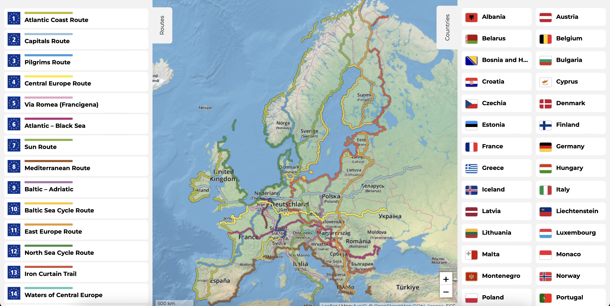
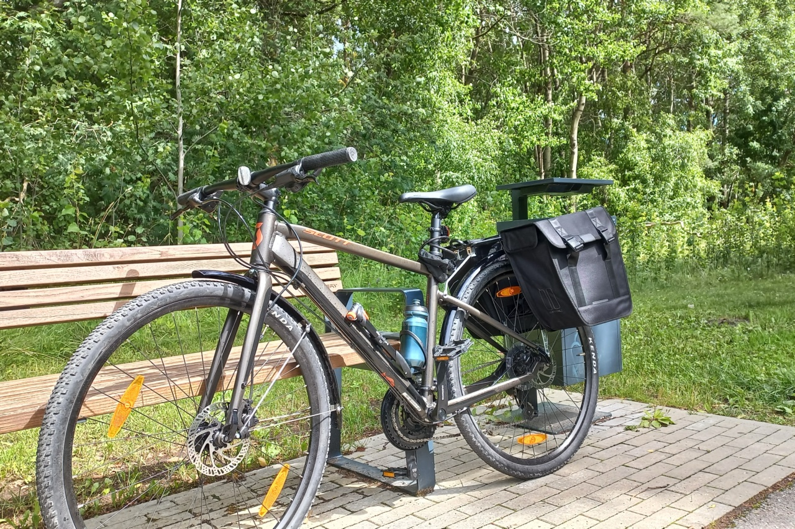
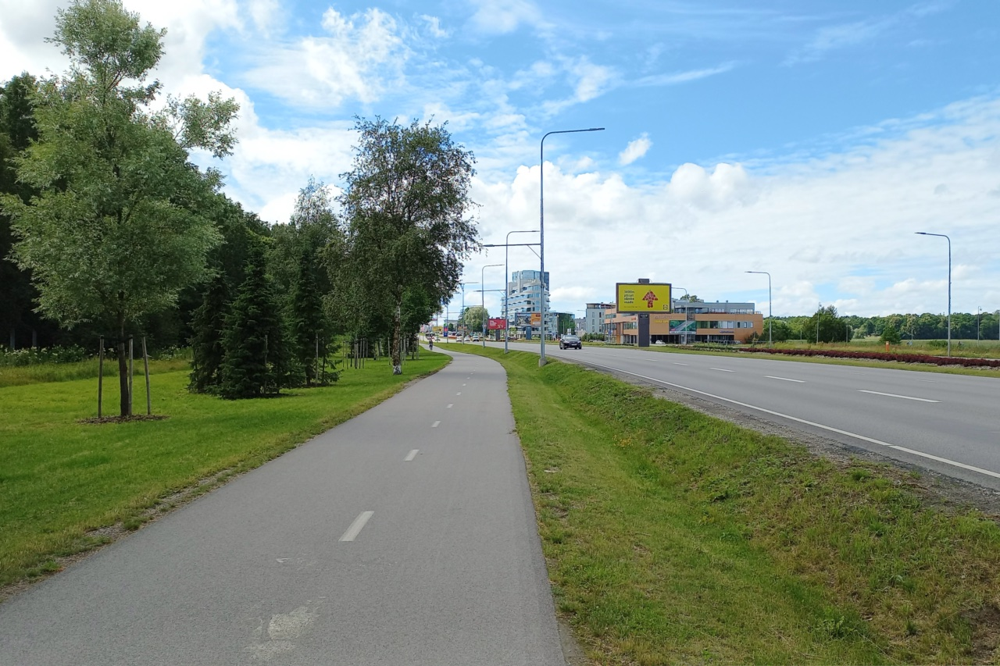
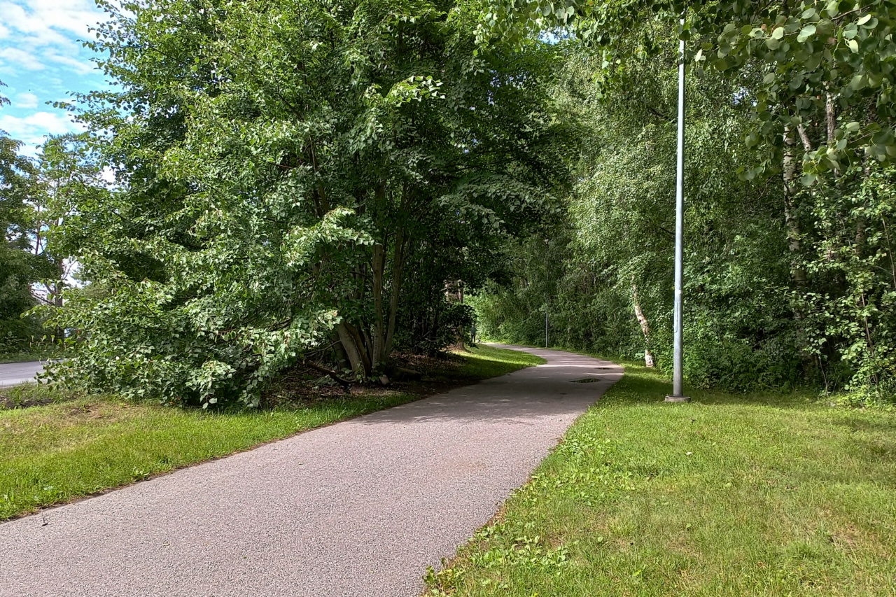
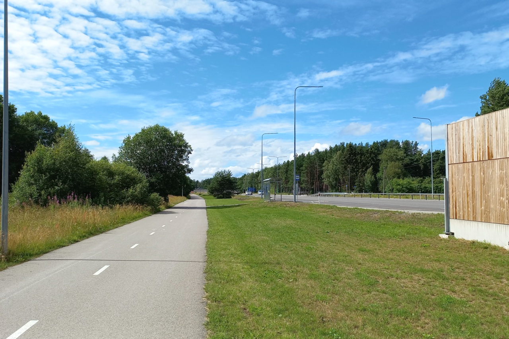
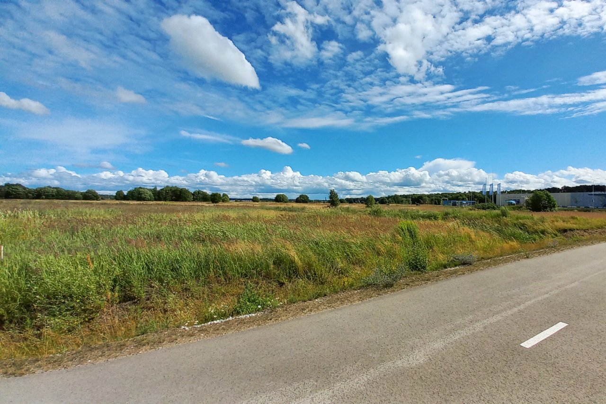
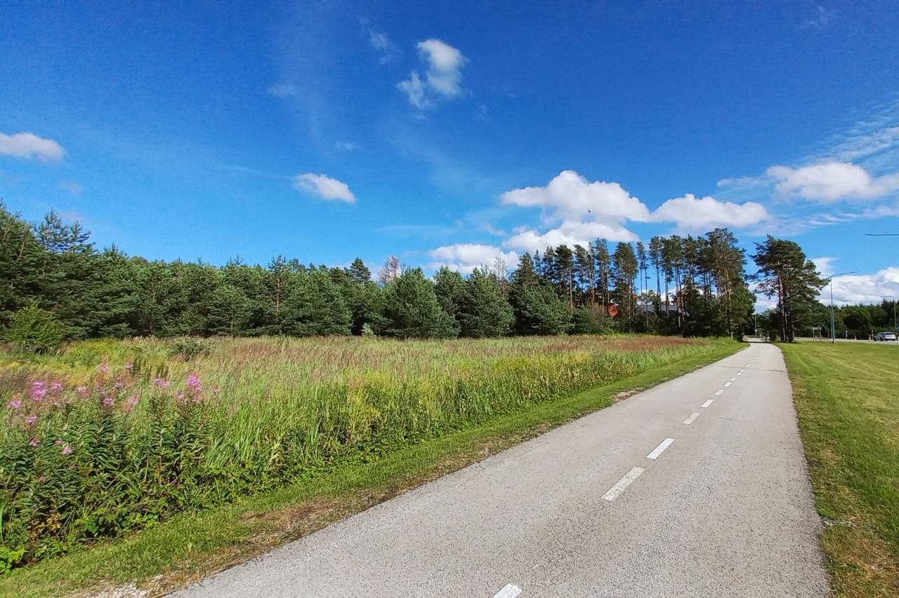
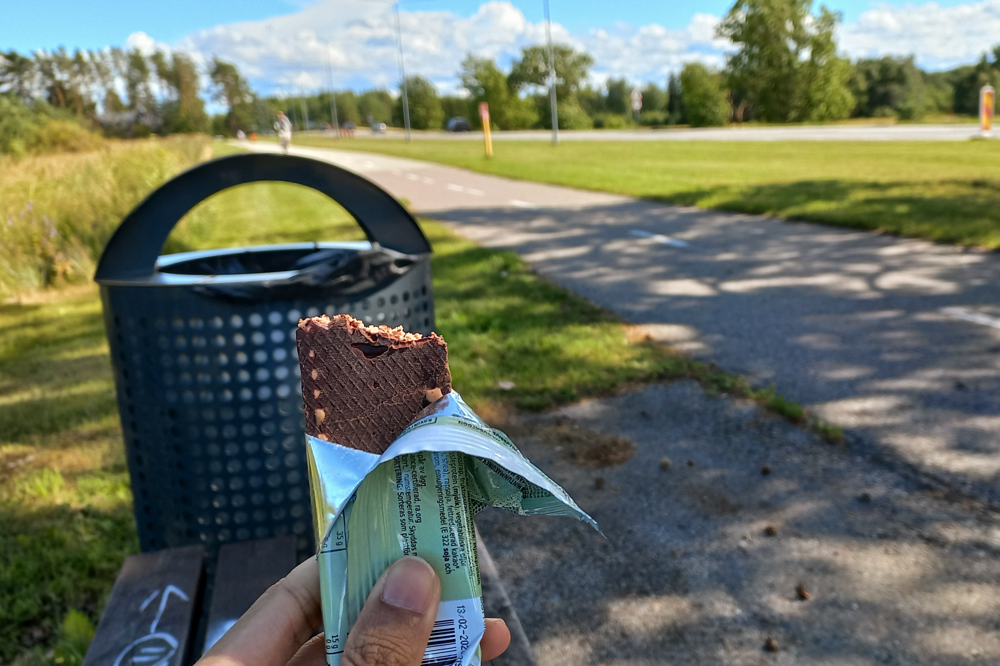

When getting around by bicycle within the city of Tallinn, I am usually able to cycle for at least 6  to 8 kilometers. It has been so fun to be able to explore the city. [A month](how-i-started-biking.md) after I started biking, I thought, “Exploring other cities seems fun too.” Especially since I started to be able to cycle for 20 kilometers.

I began to look for information on how safe it is to cycle long distances in Estonia. Finally, I was able to find out about [EuroVelo](https://en.eurovelo.com). EuroVelo is a long-distance cycling route between countries that connects the entire European continent. There are three EuroVelo routes in Estonia which are:
1. Route 10 - Baltic Sea Cycle Route
2. Route 11 - East Europe Route
3. Route 13 - Iron Curtain Trail

*Map of EuroVelo routes across Europe.*

I started to feel challenged. Exploring other cities in Estonia by bike seems exciting. Especially since this EuroVelo route (according to the map) doesn't pass through the main intercity streets which are full of cars. So, it most certainly has many interesting places to visit and to be photographed.

### Training for 100 kilometers 

I began to set a target of cycling for 100 kilometers a day. It’s of course an achievable target but it requires preparation and training. I didn’t plan to cycle as fast as I can to achieve 100 kilometers, rather I want to do relaxing cycling with a lot of stops to take photographs. Even so, I still need to train so I won’t get tired easily.

I tried to increase the distance of my cycling. On one weekend I was only cycling for 20 kilometers. Then on the weekend after, I increased my distance to 40 kilometers.

The route I took was following EuroVelo 10 leading to the west of Tallinn to Rannamõisa, a village in a small city called Harku. Along the way, there were indeed a lot of people cycling either in groups or solo. Some of the bikes that I came across were also seen in bike touring setups using bags attached to the bicycles.

*Bike touring training with bags, food supplies, pumps, and various equipment for bicycle repair.*

On the previous night, I did a lot of preparations by watching various YouTube videos on how to do long-distance cycling effectively. From the effective way to change gears to how to keep the cadence. I practiced all of those during my first 40 kilometers of training. 

At first, I was unsure of whether I’ll be able to do it. But after trying, I prove to myself that I can do it! Even though the day when I tried my first 40 kilometers was windy. On my first 20 kilometers, I was cycling so hard against the wind that had 30-37km/h of speed. It felt really difficult in the beginning, but it was very satisfying when I achieved the distance.

**Some pictures from the EuroVelo route I was on**

*Resting while eating an energy bar.*
