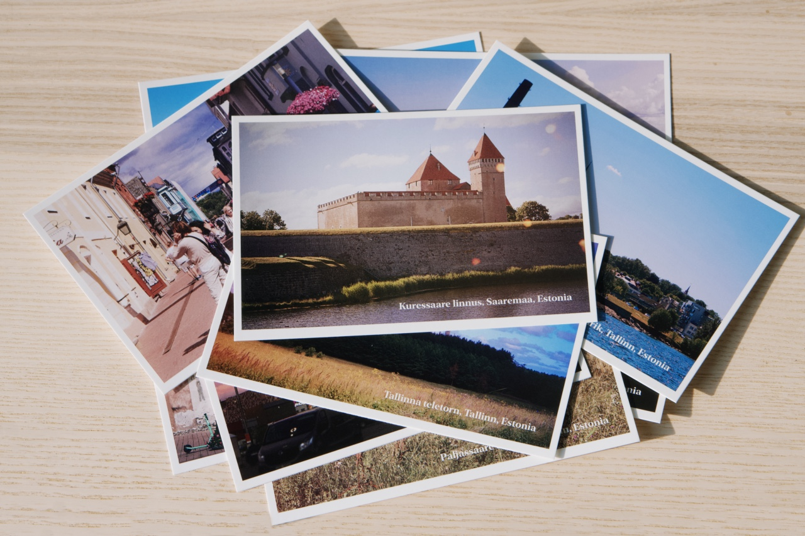
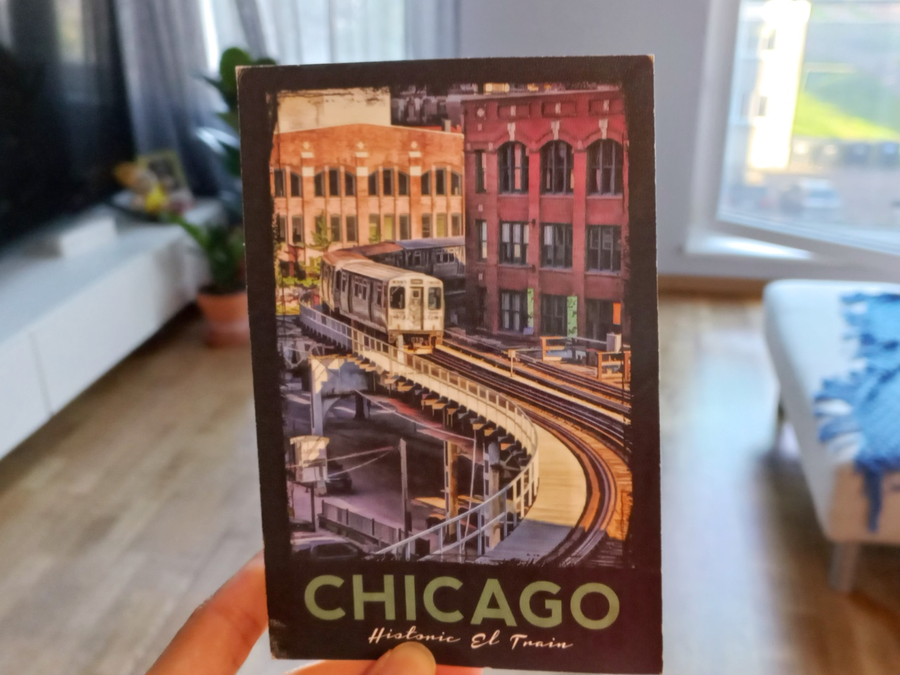
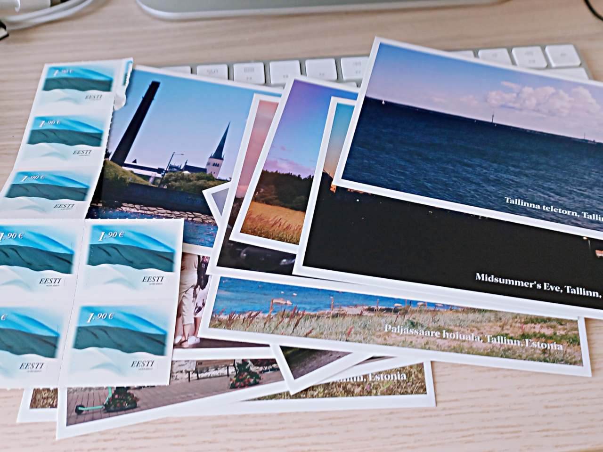
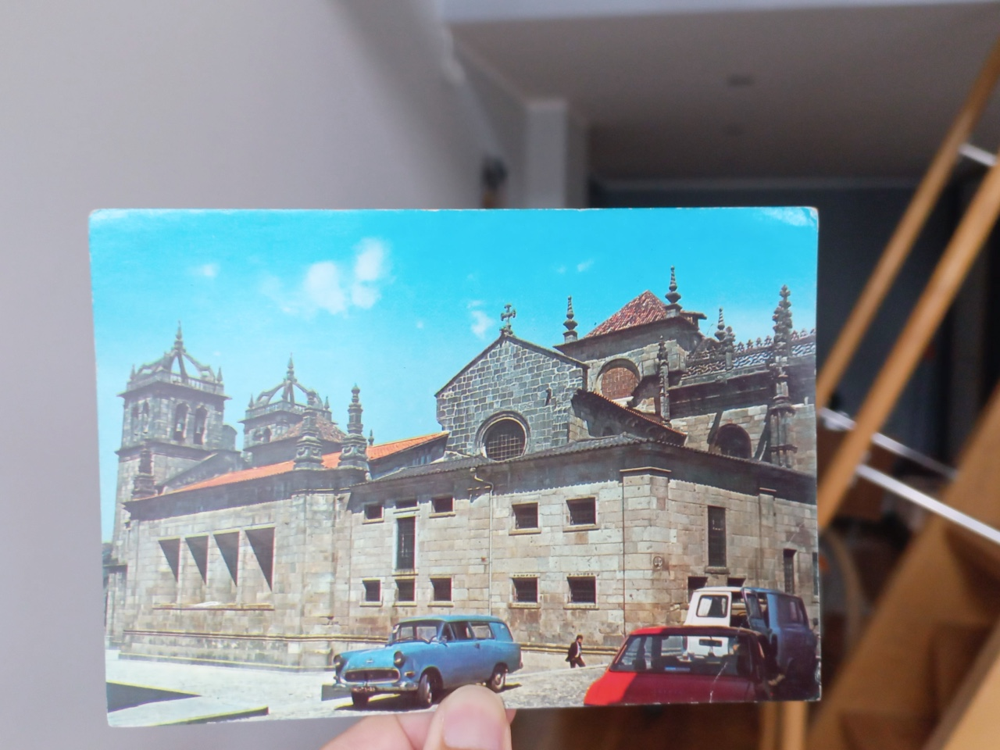

People who were born from the years 1981-1996 or commonly called the millennial generation (generation Y), are the transition generation between all-analog and digitalized lives, thanks to the existence of the internet and cellular phones. Especially if you’re a millennial born before 1990, there’s a high chance that you experienced a lot of analog communication modes, such as phone cards, telephone coins, mail exchanges, or even having pen pals in your childhood and adolescence. 

When I was little, I’d usually move around the cities once every 3-4 years to follow my father, who was working as a civil servant. As a result, my childhood friends scattered in some cities. Interlocal phones were still expensive back then, so I sent mail and greeting cards from the post office to communicate with friends from other cities.

Of course, this communication process via mail took a long time. Imagine waiting for mail replies from East Java to Papua (I used to live in Jayapura), which could take several weeks. The Postman was someone that you’d always look forward to. 

*Postcards that I printed from my photos.*

In July 2022, I chatted with some friends around my age in a group chat about how fun it was to send Eid greeting cards and postcards. This group chat existed because we have lived in Bali and Jakarta, and now some people have already moved again. There is a friend in Jakarta that already moved to the United States, a friend from Bali who moved to Portugal, including me that already moved to Estonia from Bali, and there is a friend that moved from Bali to Jakarta.

I said at that time, “Sometimes I want to exchange postcards again. The last time I sent Eid greeting cards was in 2011. Sent them to my social media friends that want to exchange greeting cards.”

It turned out that a friend replied, “Let’s exchange. In 2019 I still requested a postcard from a friend in the Netherlands. I still keep it 😆 Physical things just seem more special nowadays. I guess it’s because they require more effort.”

Then a friend in the United States replied, “The last time I exchanged postcards was at the beginning of the pandemic when the new Trump-appointed USPS boss wanted to shut down post offices. So, we bought stamps to give a little bit of support.”

Since some friends also wanted to exchange messages through the post office, we decided to exchange postcards. The choice fell to postcards because they usually have unique designs or pictures from the sender’s city or country.

I immediately thought about creating my own postcard because I have a lot of landscape photos from various places in Estonia that I took while cycling or going on holidays outside of the city. From Tallinn to some other cities.

The first thing that I did was look for a place where I can print my own postcards. After googling printing places in Tallinn, I found some printing shops that can print postcards. Unfortunately, all of those print shops were too expensive for me if I want to print single postcards with different pictures. In other words, printing 10 postcards with 10 different pictures are way more expensive than printing 10 postcards with 1 same picture.

Finally, I thought about looking for a print-on-demand service provider, instead of regular print shops. Print-on-demand places can print individually with different designs affordably. It doesn't matter if the company isn’t located in Estonia, as long as the printing and shipping costs are still affordable.

After considering some print-on-demand places that can print postcards, I decided to go with [Printful](https://www.printful.com/a/liveinestonia). The printing cost is still within my budget, and the shipping fee is only 4€ because they’re sent from Latvia. Latvia is a neighboring country in the south of Estonia.

I initially tried to print 5 pieces and the results weren’t very good. Of course, it wasn’t the print-on-demand place’s fault. It was my fault because I wasn’t very good at adjusting the design. Understandably, it was my first time printing postcards. I felt that the print results weren’t decent enough to be sent to my friends. Finally, I decided to print the second design iteration. I waited for about a week again to get the print results sent to my home.

While I was waiting for my postcards to be printed, one postcard from my friend in Chicago, United States arrived. It did indeed feel different when seeing my friend’s handwriting on that postcard compared to when seeing their typing on the phone or computer screen. Especially, seeing that the postcard is already slightly worn and folded at the ends due to the very long delivery process. It made me really want to keep the postcard well.

*A postcard from Chicago, United States*

My postcard order finally arrived.

Another difficulty I faced was, “What am I supposed to write in this postcard?” 😅 It was tricky because we chat on daily basis in the group chat, so if I am asking again how are they doing in the postcard, it may seem odd and irrelevant. After consideration, I decided to write a little story behind the pictures I took in the postcards.

After the messages were written, I immediately went to the post office to send those postcards. I  then found out that the delivery cost for international postcards is actually not expensive. The stamps cost only 1,9€ for each delivery to the United States, Portugal, and Indonesia.

*The postcards that I sent from Estonia.*

After returning from the post office, I curiously checked my mailbox. “Whoa, there’s a postcard from my friend that lives in Braga, Portugal.” Just like the previous postcard I received, this postcard was also already worn. It looked even more beautiful to my eyes. 😆

*A postcard from Braga, Portugal.*

I learned a few things from these postcard exchanges:

The photos I captured actually look more beautiful and alive when printed compared to being enjoyed on Instagram.
After frequently communicating digitally and instantly, it turns out that receiving messages from the post office gives a different sensation. It just feels more special.
I learned where to print my own postcards at an affordable price.
I got the experience of sending mail from the post office in Estonia.

Another benefit I received was I learned how to sell my picture works in the postcard media. You can visit my shop, [Live in Estonia, on Etsy](https://www.etsy.com/shop/LiveInEstonia).

