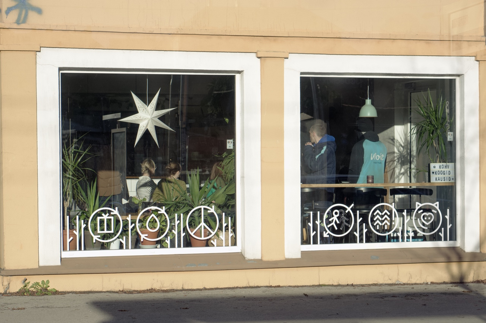
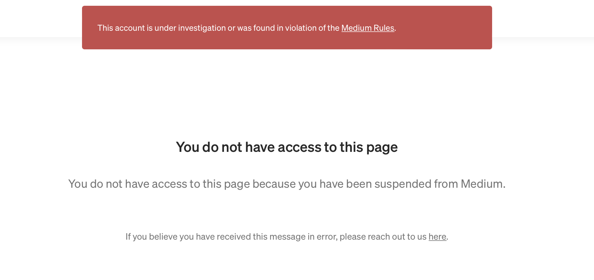

Three years ago, I wrote about [reprioritizing my blog instead of social media](going-back-to-personal-web.md). I did not mention any specific reasons in that article because I only wanted to revive this blog. Several years later, my decision was proven right. Why so? Now, I have reasons.

*A cafe in Kalamaja area, Tallinn.*

### Content on blogs is easy to search and find.

When I looked at the data for visitor visits to this blog, it turned out that most visitors came from search engines like Google, Bing, and Yahoo. Visits from social media are not that big. Imagine if I only wrote on Twitter and Facebook. I'm pretty sure many of my posts might be hard to find by other people.

### Independent from the rules of third-party platforms.

Several years ago, I was consistently writing on Medium. My writing got many tractions on the platform. Also, articles published on Medium were easy to find by using a search engine. Just like any other blog. Then I went for totality. I even pointed my website domain to Medium.

A few years later, there were some policy changes. Medium can no longer use a custom domain. *I checked, and now they enable it again but only for Medium paid members.* As a result, my writing disappeared from search engines. Even worse, my account got permanently suspended for violating their terms of service because I also promoted links to my business at that time through articles on Medium. Even though when Medium first appeared, this was not prohibited.

*My Medium account is suspended.*

I feel upset. Things like that won't happen if we use our platform.

For example, let's say, Vercel (my current web hosting) decides to suspend my website. Then, I just moved to another hosting. The URL and address structure will also not change, so it will not affect search results on search engines.

### Third-party platforms may close at any time.

This thing just happened to me. I use Revue, Twitter's newsletter service, to send newsletters to readers who subscribe to my content. After Elon Musk bought Twitter, they decided to shut down Revue at the end of 2022.

Fortunately, I only use Revue once a month to inform the published content on this blog. So, I only need to export my subscribers' email data and move it to another newsletter service. If I focus on writing only on Revue, I will feel annoyed again. Like what happened on my Medium account.

### Conclusion

As a content creator, prioritizing our domain and website as the home of our content is the right decision. We have total control over our content. Indeed, some types of content are a bit difficult to self-hosted. Those are audio and video. It's complicated and expensive if we want to host them on our server. That's why my video content stays on [YouTube](https://www.youtube.com/channel/UCjGnuWk0n6BWx7rXshMysbw).

Finally, I invite you to subscribe to the ["Write Code, Make Sound"](https://writecodemakesound.asepbagja.com) newsletter. We will explore the topic of creative coding for music and electronic music production technology.