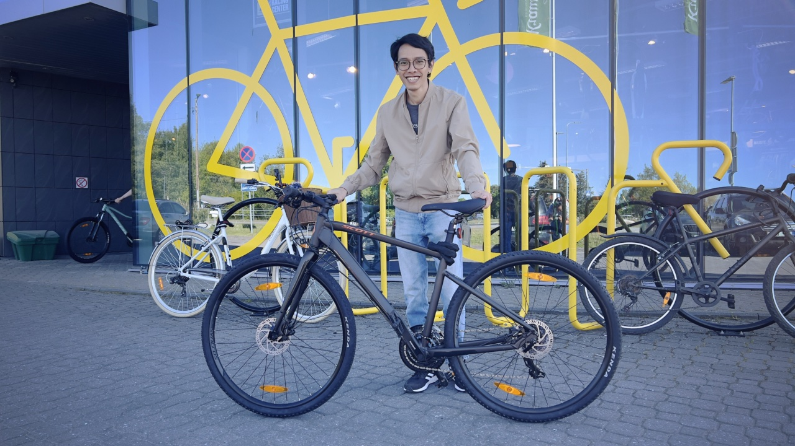
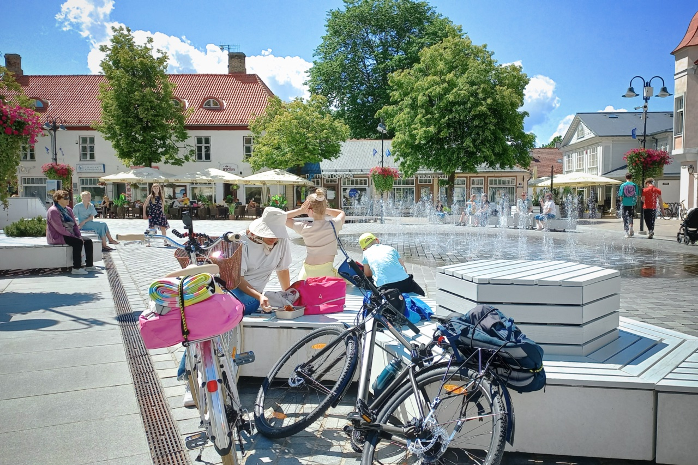
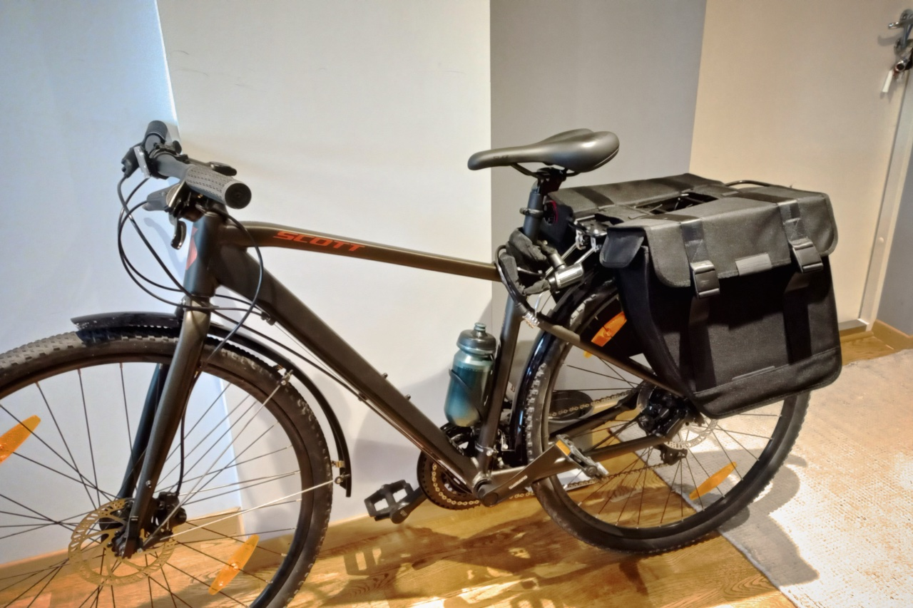
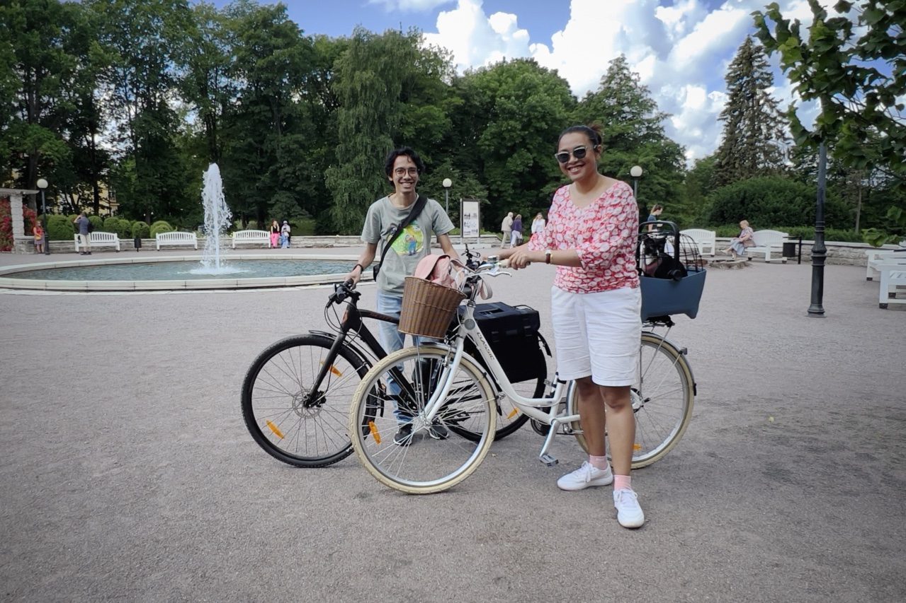

When the last snow in March stopped falling, and the air temperature got warm enough around 7°C-10°C, my wife and I started planning to buy bicycles. Since we saw that the bicycle lanes in Tallinn city are quite organized and safe, we thought it might be quite convenient to get around with bikes. Besides, Tallinn and most of Estonia are generally quite flat. There is no steep uphill. Exploring the city with bikes certainly can be fun, because we can wander more compared to using public transportation. Moreover, it makes us healthier just like The Gym of Life video explained below.

Finally, entering the month of April, my wife bought the bike first. This is because we need to adjust our budgeting and we can only buy one bicycle per month. Besides, I still didn’t know what bike I wanted to buy - whether it was a road bike, hybrid bike, or city bike. I didn’t have any plan to become an athlete, I just wanted to explore the city.

The amount of my knowledge about bikes was basically none. The last time I had a bike was in 2011 when I still lived in Bandung. After giving it some thought and watching some YouTube videos, my choice fell to the hybrid bike. My reasonings were that this can be used in asphalt roads as well as gravel roads, and it doesn’t have high speed. Finally, in June, I bought my first bike after 11 years of not biking. I chose Scott SUB Cross 50.

*Just out of the bike shop.👯‍*

### Started learning new things about bikes

Within one month after buying the bike, my knowledge about bicycle topics increased quite a bit. I learned a lot from YouTube about bike maintenance and what accessories I needed to add to suit my cycling style.

I did my first modification in the first week, which was to add a mudguard. This is useful to prevent my clothes from getting dirty due to water splashes from the tires, considering Tallinn’s weather that can have sudden rains. I’d rather reduce the coolness level of the bike than have my clothes get dirty. I cycle almost every day, with at least 8-10 km of distance. I also go to the office after lunch more often, just so that I can bike.

The second modification happened in the third week, which was adding a rear rack for the bags. I did that because at the end of last June, I wanted to enjoy the Midsummer holiday with my wife in [Kuressaare](https://goo.gl/maps/nFr3eBVmjjRqo4pbA). It’s a city on Saaremaa island, the westernmost island in Estonia. We wanted to go on vacation by bike.

*Vacationing by bicycle in Kuressaare.*

We tied the picnic mat and bags filled with our clothes on our bikes. We went from Tallinn to Kuressaare by bus. In Estonia, intercity buses can also be used to carry bicycles with free baggage fees. We only needed to pre-order the luggage space from the bus’ website.

### Started understanding the cycling style

After the vacation to Kuressaare, I started to better understand my cycling style. It turned out that I really enjoyed doing bike touring. Relaxing cycling for quite a long distance while taking pictures of many things. Eventually, I decided to add another accessory, which is a pannier bag. This bag is specifically designed to be put on the bikes’ rear rack. Just like what postmen use.

*My current bike with a pannier bag on the back.*

It’s not only me who added accessories to the bike to suit the cycling style. My wife also did the same. She’d prefer a relaxing ride on a short distance within the city though. The bike that she chose is also the city bike type. With an additional detachable cart that can be used for shopping or for carrying our beloved cat.

*Us with our bikes.*

### After one month of biking

One month after I started biking, I felt positive changes in my body. I feel more energized when I am programming for my work. My mind also feels more refreshed.

On the days when I am not cycling, because I want to rest, I’ll walk instead. The combination between walking and biking makes me no longer feel the lower back pain.

Aside from the health side, there’s also another benefit that I get. I began to enjoy exploring the city and taking photographs. Biking became a hobby that supports my photography hobby because exploring the city has become easier. You can visit my [Instagram](https://instagram.com/bepitulaz) page and [Live In Estonia](https://www.liveinestonia.com) to see my photographs.

As long as there’s no snow and ice on the road, it looks like I’ll keep biking.🚴🏼  