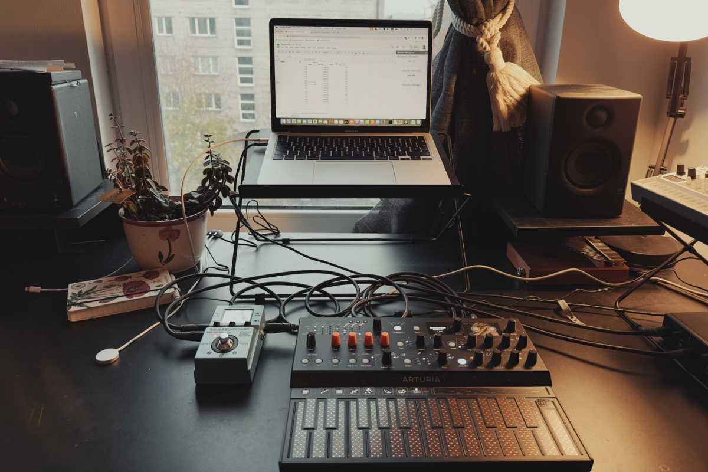
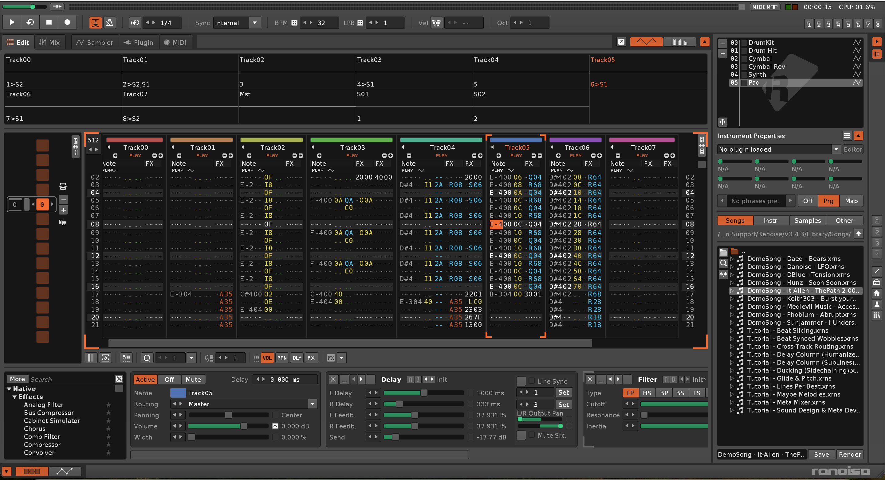
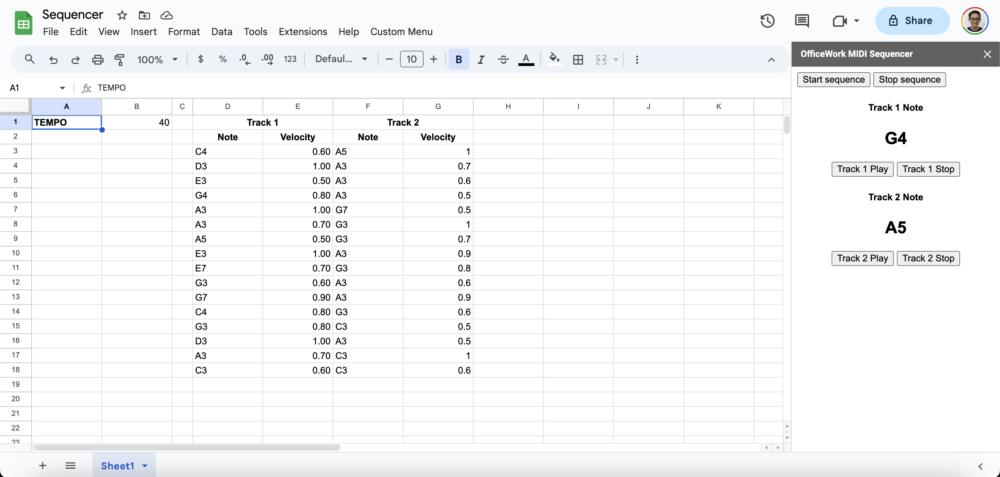

Do you know that the modern web browser can access real musical instruments? With the help of [Web MIDI API](https://developer.mozilla.org/en-US/docs/Web/API/MIDIAccess), we can create a web application that can access MIDI devices connected to our computer. In this article, I will explain how I use Google Sheets as a music sequencer for composing and playing ambient music with a hardware synthesizer.

*Google Sheets plays ambient music with Arturia MicroFreak.*

### What is a music sequencer?

A music sequencer is a device or software that can record, edit, and play back musical data such as notes, chords, velocity, or any events to automate the process of music creation or music performance. It sends the musical data to musical instruments to produce sound, typically via MIDI, CV/Gate, or OSC protocol.

Recently, I have been interested in a music sequencer in a tracker style. It is a type of music sequencer commonly used in the 80s and 90s. It is a grid-based music sequencer that uses a vertical grid of columns. Each contains several rows and columns to represent different musical data and events. It is similar to a spreadsheet.

There are modern music sequencers that use a tracker style, such as [Renoise](https://www.renoise.com) (software) and [Polyend](https://polyend.com) (hardware). However, I want to try to build a simpler version of it.

*Renoise software*

### Why Google Sheets?

Now, I understand that a music tracker is similar to a spreadsheet. So, I want to use a spreadsheet as a music tracker and sequencer. Google Sheets is perfect for that. It's free, and we can extend its functionality with Google Apps Script. It is a serverless JavaScript runtime where the developer can add custom functions to Google Sheets. The good thing is that it can access any browser API, including Web MIDI API.

To simplify the development, I use these 2 JavaScript libraries:
- [WEBMIDI.js](https://webmidijs.org), it's an abstraction layer for Web MIDI API. It simplifies the usage of Web MIDI API, such as getting the list of MIDI devices, sending MIDI messages, receiving MIDI messages, etc.
- [Tone.js](https://tonejs.github.io), it's an abstraction layer for Web Audio API. I use it only for looping the notes and velocity. Tone.js provides a global transport that can be used to synchronize the timing of the notes.

I built the web app to play and stop the sequence as a custom sidebar UI of Google Sheets. In this sidebar, all Web MIDI API and Tone.js functions are available. I also added a custom function to Google Sheets to send MIDI messages from the spreadsheet cells.

*My Google Sheets music sequencer*

If you are interested in the code, you can take a look at my GitHub repository: [Google Sheets MIDI Sequencer](https://github.com/bepitulaz/google-sheets-midi-sequencer).

### The demo video

Finally, here's the demo video of the Google Sheets music tracker and sequencer. I use it to compose and play live ambient music with my Arturia MicroFreak synthesizer. I hope you enjoy it.

