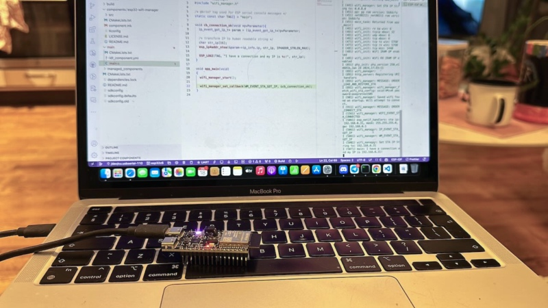
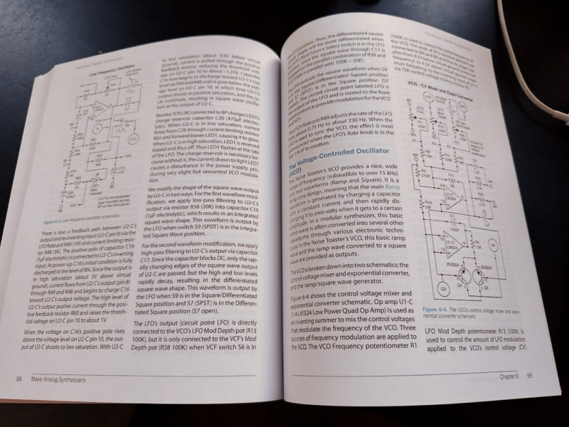

I've been building my modular synth system for a while now. I mentioned in [my previous post](starting-modular-synth-journey.md) that I wanted to design and build my modules. Initially, I wanted to create a VCO (Voltage Controlled Oscillator) module. But, I noticed that I needed a sequencer module first. Instead of buying one, I decided to build it myself. It's a perfect project to learn more about electronics and embedded programming.

### What is a voltage sequencer?

A voltage sequencer is a module that generates a series of control voltages (CV) in a sequence. The control voltages can be used to control other modules in the system. For example, it can be used to control the pitch of an oscillator.  It can also modulate the cutoff frequency of a filter. A lot of possibilities.

In the market, there are many types of sequencers. The most common ones are analogue sequencers and digital sequencers. Analogue sequencers use analogue components like op-amps and transistors to generate the control voltages. On the other hand, digital sequencers use microcontrollers or digital signal processors to produce the control voltages.

For my sequencer, I decided to build a digital one because my skill set is more on the software engineering side. Thus, I can implement the main features of the sequencer in software and deploy it to a microcontroller.

### ESP32 as the brain of the sequencer

I have these requirements for my sequencer:
- Unlimited steps in the sequence
- It should have multiple CV outputs and gate outputs, and the step length can be different for each output
- It should have a clock input to sync with other modules
- I want to be able to define the sequence and other settings using a web interface or a mobile app.

After some research, I decided to use the ESP32 microcontroller as the brain of the sequencer. The ESP32 is a powerful microcontroller with built-in Wi-Fi and Bluetooth capabilities. It has enough processing power and memory to handle the sequencer logic and serving web interface. It also has enough GPIO pins to handle multiple CV and gate outputs. More importantly, it's relatively cheap and easy to find.

*Programming ESP32 microcontroller*

The programming of the firmware will be done in C using the ESP-IDF framework. It's a set of tools and libraries provided by Espressif, the manufacturer of the ESP32 microcontroller.

### Learning electronics components

ESP32 alone is not enough to build a module for Eurorack. The voltage level in Eurorack is different from the voltage level of the microcontroller. The control voltage of Eurorack is usually in the range of -5V to +5V or 0V to +10V. The ESP32 can output 0V to 3.3V only, and it's a digital output.

For example, the standard voltage to control the oscillator pitch is 1V/octave. It means for every 1V increase in the control voltage, then the pitch of the oscillator will increase by one octave. So, with 0V to 3.3V output, the pitch will only increase by 3.3 octaves. I want to have a broader range of pitch control. At least 6 octaves or even 8 octaves. I must add a circuit to scale the voltage level from 0V to 3.3V to 0V to 8V.

I also need to add a circuit to convert the digital output of the ESP32 to the analogue control voltage. Then, I decided to create a simple RC low-pass filter to convert the digital output to analogue control voltage. The RC low-pass filter will smooth out the digital output and create a continuous control voltage.

I learned some electronic components for building analogue synths from the book "Make: Analog Synthesizers" by Ray Wilson. The book explains the basic knowledge of components like op-amps, transistors, diodes, and passive components like resistors and capacitors. It also explains how to make basic circuits like amplifiers, filters, and oscillators.

*Make: Analog Synthesizers book*

Furthermore, I also asked for help from the DIY synth community on Reddit. They were helpful. They gave me some suggestions on how to build the circuit for the sequencer. For example, they explained how to use an op-amp and debug the circuit using a multimeter. Here's the thread on [Reddit](https://www.reddit.com/r/synthdiy/comments/1cc6sd5/do_i_need_op_amp/).

### The first prototype: Jada

After working for a few weeks, I finally finished the first prototype of the sequencer. Currently, it has 2 CV outputs and 2 gate outputs. The CV outputs can be set to 0V to 6V. The step length is unlimited and can be different for each channel output. The module can be connected to Wi-Fi. However, it doesn't have any web interface yet for defining the sequence.

I named the sequencer "Jada". It's from the Estonian language, which means "sequence". I think it's a fitting name for a sequencer module.

So, here it is, Jada in action! All the sequences are still randomised inside ESP32 because I haven't implemented the sequence definition yet. But it's already generating some interesting melodies.

  
