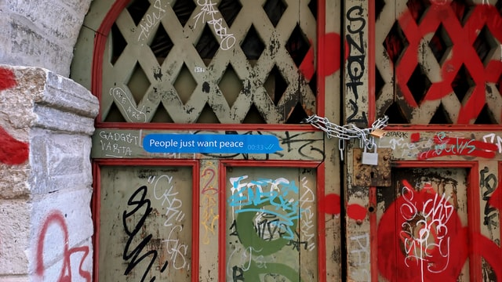

I walked around Tallinn's old town area a few weeks ago and stumbled upon this graffiti. I guess someone created it after the protest event against Russia's aggression in Ukraine in February 2022. The war that's still happening now.

*The graffiti in Tallinn's old town.*

Inspired by that graffiti and the big protest in Tallinn, I started composing this music. Peaceful music for everyone.

"People Just Want Peace" consists of two tracks, "Prologue" and "People Just Want Peace". I use field recording to create a Prologue track, my footstep on the flurry ice. I like to hear the ice sound. It feels peaceful to the ear. I keep involved a generative technique with JavaScript in this single to create a rhythmic synth sound for the main song.

You can listen to "People Just Want Piece" on [YouTube Music](https://music.youtube.com/playlist?list=OLAK5uy_k0LaLQSJhxc_bbMVTfmdFqsL-tEf5Ll2k&feature=share).
