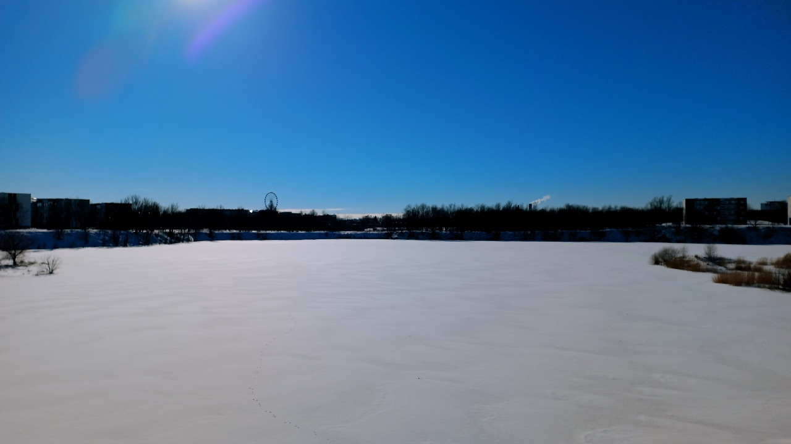

Photography is my other hobby besides music. I occasionally take photos with a mirrorless camera or smartphone whenever I go outside. Usually, I upload some of them to my Instagram profile. However, there are some great photos that I don't upload because it doesn't suit my Instagram vibe. Those kinds of photo files will end up in my cloud storage.

I don't have any idea to monetise it. So, I upload those photo files to Unsplash to become free royalty stock photos. Thus, you can use it on your content if you like. Go, check out my [Unsplash profile](https://unsplash.com/@asepbagja)! I will upload many more to it.

*The representation of Estonia flag 🇪🇪 in Päe lake.*

