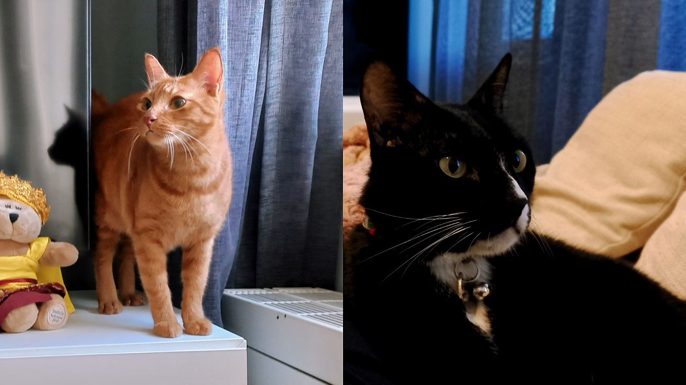
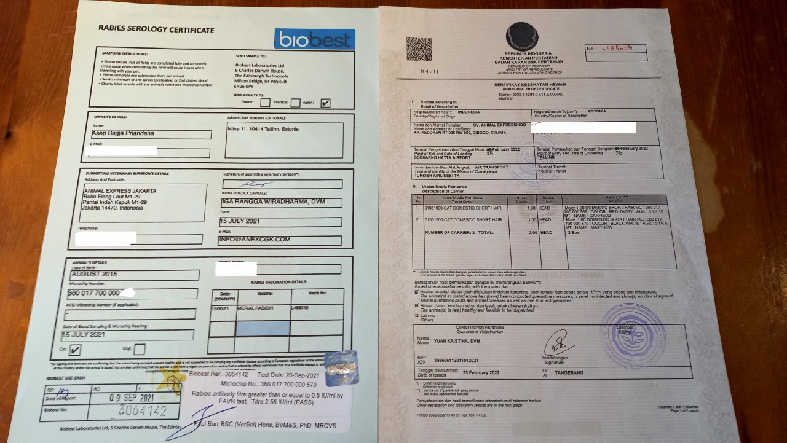
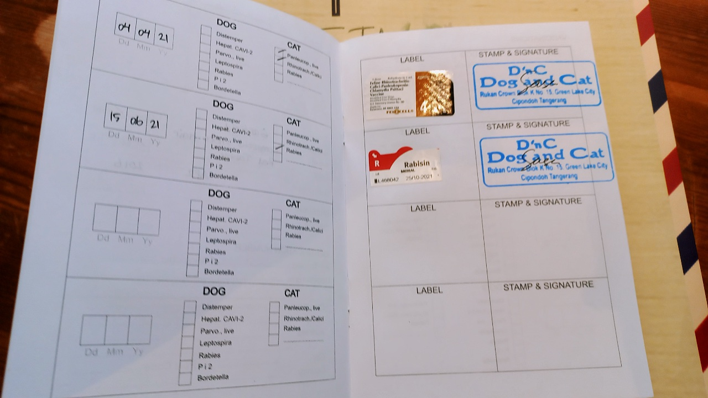
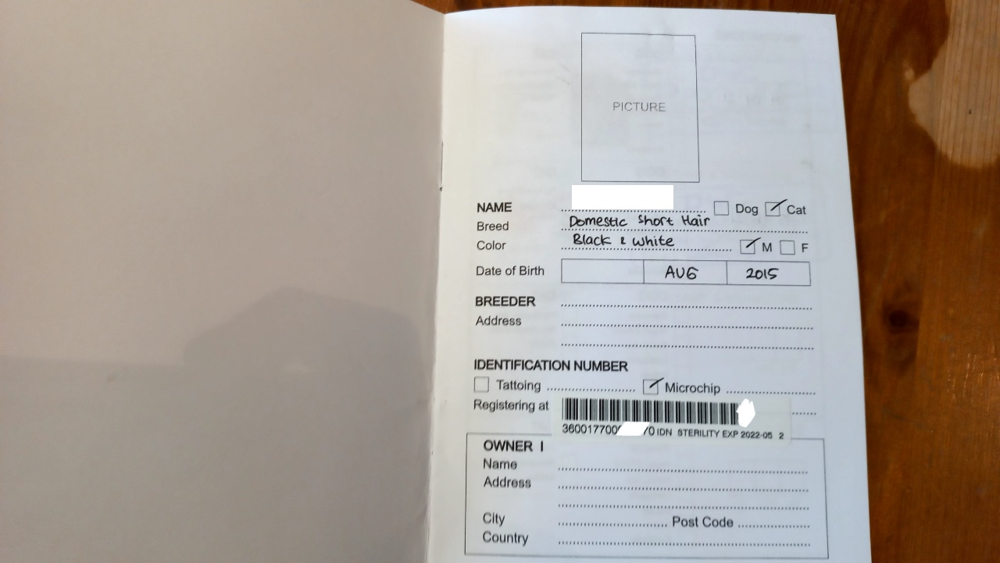
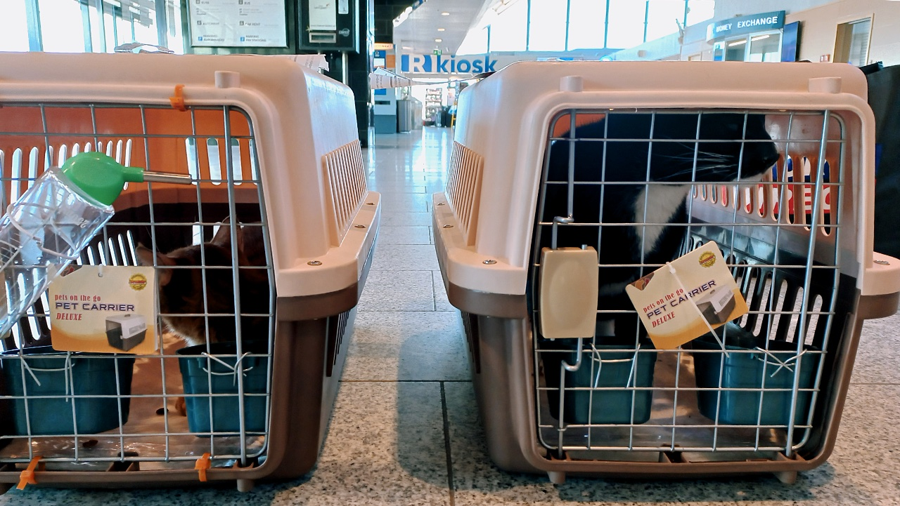

After five months of being separated, finally our beloved cats are reunited with me and my wife. The process to relocate them from Denpasar to Tallinn was quite long and cost quite a bit. Luckily the relocation costs of these cats are mostly covered by the company I work at, which believes that pets are part of the family.

Some people thought that our cats are expensive breed cats, considering how much effort we put into relocating them. However, they are domestic short-haired cats that we adopted after frequently visiting our home when they were little. We’ve adopted them since we lived in South Tangerang in 2015 and moved with us to Denpasar in 2018. They’re already a part of the family. 

*Domestic short-haired cats from Tangerang in their new home in Tallinn.*

Relocating pets abroad is surely not as easy as moving abroad. There are a lot of rules that we need to pay attention to, especially since we moved to a country that is a member of the European Union. The European Union is known as an area that has the most rules. What made us stressed was the busy moving schedule. We only had about 3 months since I got hired to the Estonian office. So, what did we prepare to relocate our fur boys?

### Finding out about animal import rules in Estonia

This was the very first thing we did. Using Google, we searched for information on how to bring pets from third-world countries to Estonia. Finally, we found the info on the website of [Põllumajandus- ja Toiduamet (Agriculture and Food Board)](https://pta.agri.ee/en/animals/travelling-pet). The site provided the procedures for traveling with animals for non-commercial purposes (not for sale or transfer of ownership purposes).

From that site, we concluded that pets are able to enter the country, as long as it’s within 5 days of the pet owner’s arrival date. Other than that site, we also found the information on the required documents from [PetTravel.com](https://www.pettravel.com/immigration/Estonia.cfm).

To put it short, the procedures and required documents are:
1. Cats or dogs need to have a microchip injection that fits the European Union’s standard.
2. Rabies vaccination, since Indonesia is a country with a high level of rabies.
3. Rabies titer test. This takes 4-6 weeks because we need to send the pets’ blood test samples to laboratories that are recognized by the European Union, in this case the laboratory is in England.
4. Health certificates from the veterinarians that are recognized by the Animal Husbandry Department.

*The health certificate and rabies test document.*

*Rabies vaccination and other supporting vaccination certificates.*

*Microchip’s barcode that was injected into the cat’s skin.*

Since we were afraid of making a mistake, finally we decided to use a pet relocation service to take care of all the required documents. Besides, we felt that we were unable to take care of the pet-related business while we were taking care of our relocation documents at the same time. Our minds were too full to think about everything, especially since we only had 3 months time. The agent that helped us take care of all the documents at that time is [Animal Express](https://animalexpress.co.id).

### The timeline that you need to pay attention to

There are some timelines that you need to pay attention to when taking care of pet relocation to Estonia (the rules are almost the same for other country members of the European Union), such as:
1. Microchip injection needs to be done after rabies vaccination so that you can insert the vaccination data inside the microchip.
2. A rabies titer test can only be done 3 months after the rabies vaccination date, and the results will be released within 4-6 weeks (this excludes the time to send the blood test sample).

Considering the timeline that requires more than 3 months, we needed to leave our pets for a while in Indonesia with heavy hearts. We decided to take care of the human relocation business first, from immigration documents, looking for an apartment, to waiting for our residence permits in Estonia to be granted.

Eventually, in September 2021, my wife and I traveled to Estonia while our cats traveled to Bekasi, a city close to the Indonesia capital, Jakarta. At that time we decided to send them from Denpasar to Bekasi to be checked in to a pet hotel we frequently use, [Pondok Pak Chiko](https://www.instagram.com/pondokpakchiko/). When we were still living in South Tangerang, we often checked in our pets there whenever we needed to go outside of the city.

### Choosing the airlines to bring pets

In February 2022, we decided to pick them up. Why did we need to pick them up, instead of just sending them? It’s because of the “5 days arrival with the owner” rule. If an animal is being transported without proof that the owner is also flying from the origin country to the European Union, then the animal’s status will change to “commercial import”. The documents will be different and the cost is a lot more expensive. Also, the animal can only be transported to Frankfurt, Germany because Estonia doesn’t allow any animal in without the owner. This means we’ll end up needing to fly to Germany to pick them up. Since this is a very expensive option, it’s cheaper and easier to pick them up from Indonesia.

As for the airlines, there are 2 popular options that people use for international flights with pets: Qatar Airways and Turkish Airlines. Turkish Airlines actually provide an option to bring cats or small dogs inside the cabin (no need to put them in the cargo), and the price per kilogram is only half of the price per kilogram when loaded into cargo. In our case, we still put them in the cargo to avoid hassles during the transit in Istanbul, since there were airline crews that took care of them in the transit. Besides, my wife was the only one to pick them up, so it wasn’t possible since one passenger is only allowed to bring one pet inside the cabin.

After consideration, our choice fell to Turkish Airlines since it’s the only airline that provides direct flights from Jakarta to Tallinn. Qatar Airways only has the Jakarta-Helsinki option. We felt that it was too much of a hassle and it would be tough for the cats if we needed to bring them in cold temperatures from Helsinki, Finland to Tallinn, Estonia by ferry. They’d also need to adapt from a tropical country to a subtropical country.

Considering that my place is only 5 minutes away from the Tallinn airport, the choice of using Turkish Airlines is the best since the cats won’t need to get cold outside for too long.

*They were registered as Turkish Airlines’ cargo*

That’s our story of relocating our beloved cats from Denpasar to Tallinn. Now our fur family has reunited and become expatriate cats. 😸
