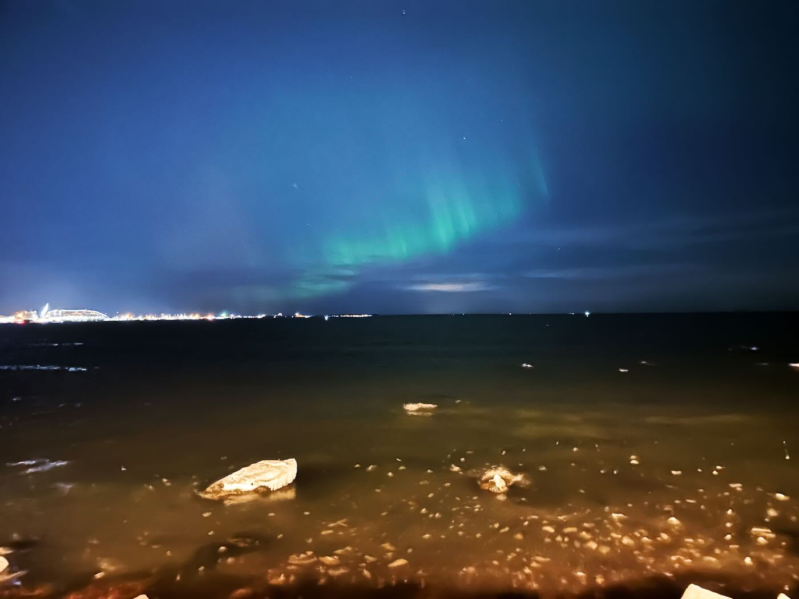
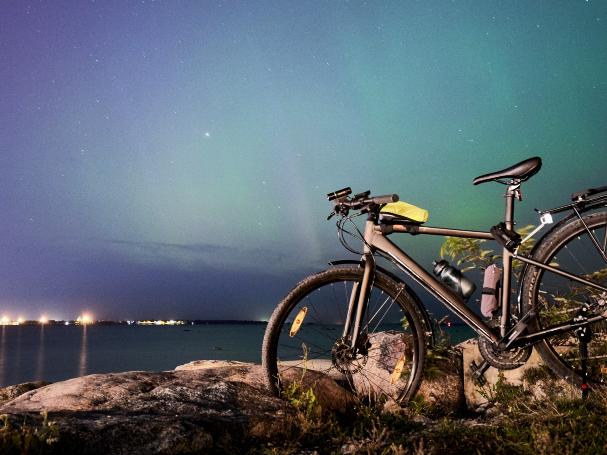

Aurora adalah fenomena alam di mana langit malam menghasilkan pancaran cahaya yang menari-nari. Fenomena ini terjadi akibat adanya interaksi antara medan magnetik bumi dengan partikel bermuatan yang berasal dari matahari. Fenomena ini hanya bisa dinikmati di daerah kutub utara dan kutub selatan. Di kutub utara, fenomena ini disebut Aurora Borealis atau Cahaya Utara. Sedangkan di kutub selatan disebut Aurora Australis atau Cahaya Selatan.

Sudah sejak lama saya ingin sekali melihat dan memotret fenomena ini. Saat itu saya memahami untuk melihat Aurora Borealis, kita harus pergi ke negara-negara yang berada di sekitar kutub utara. Negara-negara yang selalu disebut di banyak artikel soal Aurora Borealis adalah Norwegia, Islandia, Swedia, Finlandia, dan Kanada. Itu pun saya masih mengira kita harus pergi ke daerah di negara tersebut yang ada di dalam area lingkar kutub.

Saya pun berpikir, "Ah, mungkin saya tidak akan pernah melihat Aurora Borealis." Karena untuk pergi ke negara-negara tersebut membutuhkan biaya yang tidak sedikit apalagi dulu saya masih tinggal di Indonesia.

*27 Februari 2023. Aurora Borealis terlihat dari pantai Russalka, Tallinn.*

### Aurora Borealis di Estonia

Nasib berkata lain. [Dua tahun lalu, saya mendapat pekerjaan yang membawa saya untuk pindah ke Estonia](mencari-kerja-di-luar-negeri.md). Negara yang berada di selatan Finlandia, dan sebenarnya masih cukup jauh dari lingkar kutub sekitar 793 kilometer. Saya pun berpikir, "Setidaknya sekarang sudah agak dekat dengan kutub utara. Mungkin saya bisa melihat Aurora Borealis, karena biayanya jadi lebih murah."

Sampai satu saat, saya melihat sebuah foto di Twitter (X) dari seorang meteorologis Estonia yang menunjukkan foto Aurora Borealis di Estonia. Saya pun mencari tahu apa benar kita bisa melihat Aurora Borealis di Estonia. Sampai akhirnya saya menemukan sebuah grup di Facebook yang bernama [Eestimaa virmalised (Northern light Estonia)](https://www.facebook.com/groups/405649242793967). Di grup tersebut orang-orang berbagi foto-foto Aurora Borealis yang mereka lihat di Estonia.

Ternyata memang benar kita bisa melihat Aurora Borealis di Estonia selama bukan musim panas, tidak ada polusi cahaya, dan langit cerah.

### Melihat Aurora Borealis

Aurora Borealis tidak bisa diprediksi dari jauh-jauh hari kapan akan muncul. Tapi kita bisa mengira-mengira dengan melihat aktivitas matahari. Jika aktivitas matahari sedang tinggi, maka kemungkinan besar Aurora Borealis akan muncul. Kita bisa melihat aktivitas matahari di [Space Weather Live](https://www.spaceweatherlive.com/en/solar-activity). Ada beberapa aplikasi iOS dan Android yang membantu untuk memberi notifikasi jika aktivitas matahari sedang tinggi. Biasanya aplikasi tersebut akan memberi tahu dalam beberapa jam ke depan ada peluang Aurora Borealis terlihat di Estonia. Sehingga saya bisa mempersiapkan diri untuk pergi ke tempat yang tidak ada polusi cahaya.

Saya biasanya menuju ke area pinggir laut di Tallinn. Tidak jauh dari rumah saya. Hanya sekitar 3-4 kilometer bersepeda. Jika ada notifikasi dari aplikasi, saya akan segera pergi ke sana di antara jam 9 malam hingga jam 11 malam. Saya tidak bisa bertahan lebih lama lagi karena sudah tidak kuat bergadang. Apalagi di pinggir laut biasanya sangat dingin dan berangin.

*18 September 2023. Bersepeda untuk memotret Aurora Borealis dari pantai Pirita.*

Aurora Borealis ternyata cukup sulit untuk dilihat dengan mata telanjang. Pendaran cahaya hijau, biru, dan ungu terlihat sangat tipis. Paling mudah dilihat dengan kamera. Kamera ponsel pun sudah cukup untuk bisa melihat Aurora Borealis dengan jelas. Berikut ini salah satu penjelasan yang saya temukan di Internet [mengapa kamera bisa melihat Aurora Borealis](https://futurism.com/how-we-see-the-aurora-borealis-camera-vs-human-eyes-2) dengan lebih jelas dibandingkan mata telanjang.

> The human eye is not very sensitive to color at night. The cones in our eyes that are responsible for color vision require a lot of light to work. At night, we rely on our rods, which are more sensitive to light but can’t distinguish color. So, when we look at the night sky, we see mostly black and white. Cameras, on the other hand, can capture color in low light because they are more sensitive to light than our eyes are. They can also take in light for longer periods of time, which allows them to capture the fainter colors of the aurora.

Berikut ini beberapa foto Aurora Borealis yang saya ambil di Estonia sepanjang tahun 2023. Akhirnya salah satu impian saya tercapai tanpa harus pergi ke negara-negara yang jauh dari Estonia, sehingga saya tidak perlu mengeluarkan biaya yang banyak. Cukup dengan bersepeda dan menunggu di pinggir laut.

  
  

  
  
