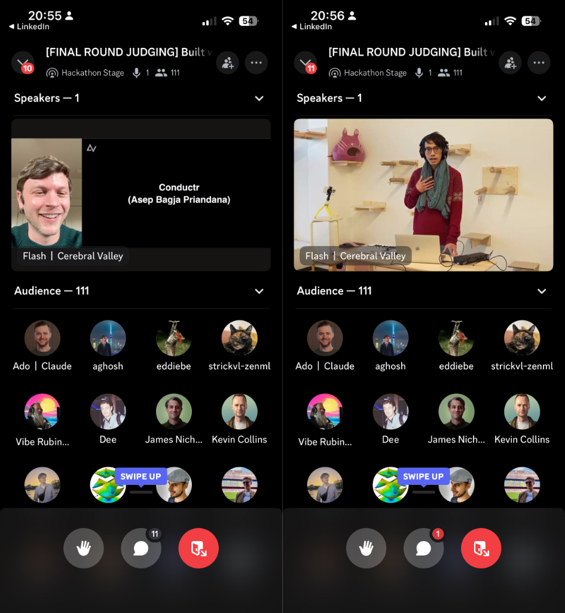
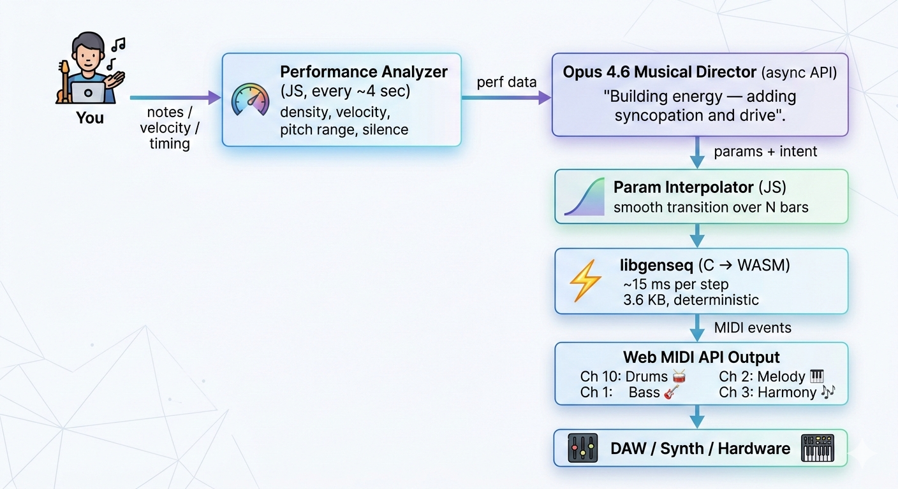

Saya sedang menonton pengumuman pemenang babak final secara langsung di Discord Claude. Istri saya ada di sebelah, lagi main PlayStation. Kami berdua tidak mengharapkan apa-apa. Lalu si pembawa acara menyebutkan nama saya sebagai pemenang kategori Creative Exploration, dan kami berdua langsung membeku. Proyek saya, Conductr, memenangkan kategori "Creative Exploration of Opus 4.6" di *hackathon* Anthropic yang bertajuk "Built with Opus 4.6". Hadiahnya $5.000 dalam bentuk *API credits*. Kalau kamu pernah membangun sesuatu pakai *large language model*, pasti tahu itu ibarat bahan bakar untuk bereksperimen selama berbulan-bulan.

Sedikit konteks soal skalanya. Lebih dari 13.000 orang mendaftar ke *hackathon* ini. Anthropic memilih 500 peserta dan memberikan masing-masing $500 *API credits* untuk membangun sesuatu dengan Claude Opus 4.6. Dari 500 peserta itu, yang benar-benar mengirimkan proyek cuma 277, memperebutkan total hadiah $100.000.

Yang paling mengejutkan buat saya justru bukan kemenangan saya sendiri, tapi keberagaman para pemenangnya. Juara pertama diraih oleh seorang pengacara. Juara ketiga oleh seorang dokter jantung. Salah satu pemenang penghargaan "Keep Thinking" adalah seorang insinyur jalan raya. Mereka bukan orang-orang yang biasa kita lihat dari *startup* Silicon Valley. *Hackathon* ini benar-benar menghargai pemikiran kreatif dari orang-orang yang membawa keahlian domain mereka masing-masing.

Nah untuk saya, keahlian domain itu ada di pertemuan dua hal yang sudah lama saya tekuni: kode dan musik. Kalau kamu sudah sering baca blog saya, pasti tahu saya pernah membangun [voltage sequencer untuk sistem Eurorack](../en/making-sequencer-esp32.md), [bereksperimen dengan programmable music](../en/geekcamp-jakarta-2015-programmable-music.md), dan menghabiskan waktu berjam-jam dengan [keyboard workstation Korg Kross 2](../en/why-i-use-keyboard-workstation.md). Conductr lahir dari semua itu.

### Keyboard yang Menanam Benih Ide

Kalau kamu pernah memainkan keyboard Korg, khususnya yang dilengkapi KARMA seperti Korg Kronos atau workstation KARMA yang original, pasti pernah merasakan sesuatu yang ajaib. KARMA itu singkatan dari Kay Algorithmic Realtime Music Architecture. Sebuah sistem yang dirancang oleh Stephen Kay untuk menghasilkan pola musik secara *real-time* berdasarkan aturan algoritmik. Bukan *loop* rekaman. Bukan arpeggio sederhana. Ini benar-benar generasi MIDI prosedural berbasis aturan dengan lebih dari 400 parameter yang bisa dikonfigurasi per efek.

Kamu menahan sebuah *chord*, dan KARMA menghasilkan aransemen musik lengkap di sekitarnya: pola drum, *bass line*, frasa melodi, *rhythmic comping*. Sistem ini merespons dinamika permainan kamu, pilihan nada kamu, dan *timing* kamu. Rasanya seperti hidup.

Masalahnya? KARMA sangat kompleks. 400+ parameter per efek itu memang *powerful*, tapi mengonfigurasinya seperti memprogram synthesizer dari tahun 1970-an. Dalam, memuaskan, dan hampir mustahil dipahami kebanyakan musisi. Saya sendiri sebenarnya belum pernah punya kesempatan memainkan keyboard yang dilengkapi KARMA, tapi selalu kagum melihatnya beraksi dari video-video YouTube. Jujur saja, saya sudah lama ingin beli Korg Kronos yang baru.

Di situlah ide itu muncul. Bagaimana kalau AI yang menangani arahan musiknya? Jadi alih-alih mengatur ratusan parameter secara manual, kamu cukup bermain dan AI yang mendengarkan, menganalisis apa yang kamu mainkan, lalu menyesuaikan aransemen untuk melengkapi permainan kamu. Itulah yang menjadi Conductr. *Tagline*-nya: "Play anything, Opus arranges the band."

### 1.134 Baris C, Nol Alokasi Heap

Inti dari Conductr adalah *generative MIDI engine* yang saya beri nama libgenseq. Ditulis dalam bahasa C. 1.134 baris, sekitar 3,6KB penggunaan memori, dan nol *heap allocation* saat *runtime*. Semuanya dialokasikan secara statis. Kenapa C? Karena awalnya saya merancang ini sebagai produk *hardware* yang berjalan di *microcontroller*, dan di dunia itu kamu tidak punya kemewahan *dynamic memory allocation*.

*Engine*-nya punya empat generator, masing-masing bertanggung jawab atas peran musik yang berbeda:

1. **Drums**: pakai *Euclidean rhythms* untuk menyebarkan ketukan secara merata di seluruh pola. Kalau kamu belum pernah dengar tentang *Euclidean rhythms*, ini cara matematis untuk menempatkan N ketukan di M langkah semerata mungkin. Ternyata sebagian besar pola drum tradisional dari seluruh dunia itu bersifat Euclidean.
2. **Bass**: berbasis *template* dengan kesadaran *scale*. Mengikuti *root note* dan *chord tones*, menerapkan *template* ritmis yang memberikan kesan manusiawi.
3. **Melody**: *constrained random walk*. Bergerak langkah demi langkah melalui *scale* dengan lompatan sesekali, tetap dalam rentang yang bisa dikonfigurasi. Bayangkan seperti musisi yang berkeliaran tapi tahu tanda kunci lagunya.
4. **Harmony**: *diatonic interval offsets* dari melodi. Menghasilkan *chord voicing* yang bergerak paralel dengan garis melodi.

Keempat generator ini berbagi konteks musik yang sama: *root note*, *scale* (disimpan sebagai *bitmask* 12-bit, satu bit per seminada), *chord tones*, BPM, dan jumlah *swing*. Ketika konteksnya berubah, semua generator langsung beradaptasi secara bersamaan. Arsitektur ini menjaga musik tetap koheren bahkan ketika parameter berubah di tengah frasa.

Nah ini keputusan penting yang membuat Conductr bisa terwujud sebagai proyek *hackathon*. Saya cuma punya waktu satu minggu. Rencana awalnya adalah demo di *hardware* nyata, seperti ESP32 atau *microcontroller* serupa yang mengirim MIDI ke synthesizer asli. Tapi waktu untuk membangun *enclosure*, menyolder sirkuit, dan men-*debug* elektroniknya tidak cukup. Jadi saya ambil keputusan praktis: kompilasi *engine* C-nya ke WebAssembly dan *deploy* sebagai aplikasi web. Kode C-nya tetap persis sama. Cuma berjalan di *browser*, bukan di *chip*.

*Stack* web-nya cukup sederhana: vanilla JavaScript (tanpa React, tanpa *framework*), Web MIDI API untuk menghubungkan ke *hardware synth*, Web Speech API untuk perintah suara, Three.js untuk visualisasi 3D aktivitas musik, dan Vite untuk *bundling*. Itu saja.

Bagian indahnya, jalur *hardware* tidak mati. Cuma ditunda. *Engine* C yang sama yang dikompilasi ke WASM hari ini bisa dikompilasi untuk ARM Cortex-M besok, atau dibungkus jadi *plugin* VST bulan depan. Menulis dalam C dengan nol *heap allocation* itu investasi dalam portabilitas.

### Engine Tidak Pernah Menunggu AI

Ini *insight* arsitektural yang paling saya banggakan, dan jujur, menurut saya ini alasan kenapa Conductr bisa menang.

Sistemnya beroperasi pada tiga skala waktu yang berbeda:

- **Engine C** berjalan sekitar 15 milidetik per langkah. Ini *loop* generasi nada dan detak jantung musiknya. Harus solid dan deterministik. Kamu tidak bisa membiarkan ketukan drum datang terlambat gara-gara ada *network request* yang sedang menunggu.
- **Performance analyzer** berjalan setiap 4 detik. Menganalisis apa yang dimainkan pengguna, seperti rentang nada, *velocity*, kepadatan nada, pola ritmis, lalu mengekstrak serangkaian metrik musik.
- **Claude Opus 4.6** menerima metrik itu setiap 8 detik dan mengembalikan keputusan aransemen: ganti *scale*, geser level energi, tambah *swing*, kurangi drum, transposisi bass.

Prinsip desainnya yang paling kritis: **engine tidak pernah menunggu AI.** Opus beroperasi sebagai konduktor, bukan pemain. Opus membentuk frasa *berikutnya*, bukan yang sedang berjalan. Ketika Opus mengembalikan parameter baru, parameter itu masuk antrian dan baru diterapkan di batas musik yang tepat. Biasanya di awal bar berikutnya.

Dan inilah *fallback* yang membuat semuanya jalan: ketika API tidak tersedia karena jaringan lambat, kena *rate limit*, atau memang sengaja dimatikan, maka *rule-based director* yang mengambil alih. Dia membuat keputusan aransemen yang lebih sederhana berdasarkan metrik performa yang sama. Musiknya tidak pernah berhenti. AI membuatnya lebih bagus, tapi sistemnya tidak bergantung pada AI.

Saya jujur soal satu hal. Pakai Opus 4.6 untuk ini sebenarnya berlebihan. Model yang lebih kecil dan murah mungkin sudah cukup untuk menangani keputusan aransemen. Tapi *brief hackathon*-nya kan "Built with Opus 4.6" dan temanya memang menuntut itu. Kadang kamu harus ikuti *brief* supaya menang, optimisasi belakangan. (Nanti untuk penggunaan produksi bisa saja tukar ke Haiku.)

[Video demo](https://www.youtube.com/watch?v=X6CqJoyj0kI)

### Yang Saya Pelajari dan Apa Selanjutnya

Membangun Conductr dalam satu minggu mengajarkan saya beberapa hal yang layak dibagikan.

**Ikuti brief hackathon.** Ini kedengarannya sepele, tapi banyak submisi yang saya lihat merupakan rekayasa teknis yang impresif namun tidak jelas menampilkan model melakukan sesuatu yang tidak terduga. Para juri ingin melihat eksplorasi kreatif Opus 4.6, jadi saya bikin AI mendireksi band *live*. Tampilkan model dalam konteks yang tidak biasa, bukan sekadar *chatbot* atau *code generator* lagi.

**Pisahkan tanggung jawab berdasarkan skala waktu.** Ini pelajaran teknis terbesar. Kalau kamu punya komponen yang berjalan pada kecepatan yang sangat berbeda, seperti *audio loop* 15ms dan panggilan AI 8 detik, jangan buat *loop* yang cepat menunggu yang lambat. Kasih setiap skala waktu tanggung jawabnya sendiri dan biarkan mereka berkomunikasi lewat *shared state*. Pola ini muncul di mana-mana dalam sistem *real-time*, dan inilah kenapa Conductr terasa responsif meskipun bergantung pada panggilan API yang butuh waktu beberapa detik.

**Tulis kode yang portabel.** *Engine* C-nya jalan di *browser* hari ini. Besok bisa jalan di *microcontroller*. Bisa jadi *plugin* VST atau aplikasi mobile. Semua itu tidak mungkin kalau dari awal saya menulisnya pakai JavaScript. Pilih bahasa inti berdasarkan ke mana kode itu perlu dibawa, bukan di mana dia berada sekarang.

**Kombinasi minat kamu yang aneh itu justru keunggulan kamu.** Saya sudah menulis tentang kode dan musik di blog ini selama lebih dari satu dekade. Secara individual, kemampuan pemrograman C saya maupun pengetahuan produksi musik saya biasa saja. Tapi kombinasi seseorang yang membangun modul Eurorack *dan* menulis WebAssembly *dan* paham MIDI *dan* punya opini tentang komposisi algoritmik, pertemuan spesifik itu jarang ada. Campuran minat kamu yang tidak biasa itu bukan gangguan. Itu justru keunggulan kompetitif kamu.

Lalu apa selanjutnya? Saya ingin menjadikan Conductr produk *hardware* yang nyata. Sebuah kotak mandiri dengan MIDI in dan MIDI out yang ditaruh di sebelah keyboard dan mengaransemen band secara *real-time*. *Engine* C-nya sudah ada. Integrasi AI-nya sudah terbukti. Sekarang tinggal soal desain sirkuit, *enclosure*, dan mengubah prototipe *hackathon* jadi sesuatu yang bisa ditaruh di atas meja.

Kodenya *open source* di [github.com/nanassound/conductr](https://github.com/nanassound/conductr). Kalau kamu ada di pertemuan kode dan musik, atau sekadar penasaran soal arsitektur AI *real-time*, silakan cek. *Pull request* diterima, ide-ide aneh lebih diterima lagi.
