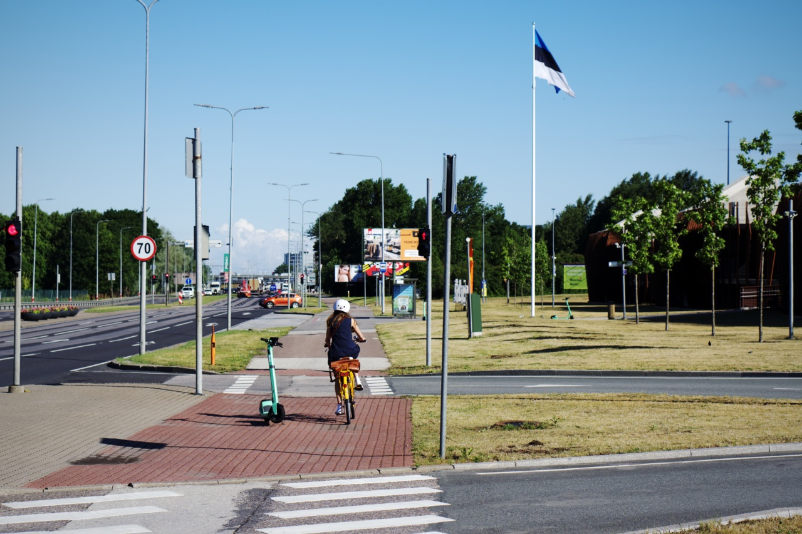

Ketika salju terakhir di bulan Maret sudah berhenti dan temperatur udara sudah cukup hangat berkisar 7°C-10°C, saya dan istri mulai berencana untuk membeli sepeda. Karena kami lihat jalur sepeda di kota Tallinn cukup rapi dan aman, jadi sepertinya cukup nyaman untuk bepergian dengan menggunakan sepeda. Selain itu, Tallin dan keseluruhan Estonia pada umumnya cukup rata. Tidak ada tanjakan yang curam. Menjelajah kota dengan menggunakan sepeda tentu menjadi menyenangkan, karena lebih bisa *blusukan* dibanding menggunakan transportasi umum. Ditambah lagi, membuat badan menjadi lebih sehat. Seperti yang dijelaskan di video The Gym of Life berikut ini.

Akhirnya memasuki bulan April, istri saya membeli sepeda terlebih dahulu. Tentu saja karena harus menyesuaikan dengan dana. Satu bulan hanya bisa untuk satu sepeda. Ditambah lagi saat itu saya masih bingung mau membeli sepeda apa. Apakah *road bike*, *hybrid bike*, atau *city bike*. Saya tidak ada rencana untuk menjadi atlet, hanya ingin menjelajah kota.

Pengetahuan saya soal sepeda benar-benar nol besar. Terakhir saya punya sepeda pun tahun 2011, ketika masih tinggal di Bandung. Setelah berpikir dan menonton beberapa video YouTube, pilihan pun jatuh kepada *hybrid bike*. Pertimbangannya karena bisa digunakan di jalan aspal maupun di jalanan *gravel*, dan tidak berkecepatan tinggi. Akhirnya di bulan Juni, saya membeli sepeda pertama saya setelah 11 tahun tidak bersepeda. Pilihan saya adalah Scott SUB Cross 50.

*Saat baru keluar dari toko sepeda. 👯‍*

### Mulai belajar hal baru tentang sepeda

Dalam kurun satu bulan setelah membeli sepeda, pengetahuan saya soal persepedaan sedikit meningkat. Saya banyak belajar dari YouTube tentang perawatan sepeda dan aksesoris apa yang perlu ditambahkan sesuai dengan gaya bersepeda saya.

Modifikasi pertama yang saya lakukan di satu minggu pertama, adalah menambah *mudguard*. Itu berguna untuk menghindari baju kotor akibat cipratan air dari ban. Pertimbangannya adalah karena cuaca Tallinn yang bisa sewaktu-waktu hujan. Saya lebih baik mengurangi tingkat kekerenan tampilan sepeda, dibanding membiarkan baju saya kotor. Saya bersepeda nyaris setiap hari, dan paling tidak bisa menempuh jarak 8-10km. Saya pun jadi rajin pergi ke kantor setelah makan siang, hanya karena agar bisa bersepeda.

Modifikasi kedua di minggu ketiga adalah menambahkan rak belakang untuk menaruh tas. Hal itu saya lakukan karena di akhir Juni kemarin ingin menikmati liburan *midsummer* (tengah musim panas) bersama istri di kota [Kuressaare](https://goo.gl/maps/nFr3eBVmjjRqo4pbA). Sebuah kota di pulau Saaremaa, pulau terbarat di Estonia. Kami ingin berlibur sambil membawa sepeda.

*Berlibur menggunakan sepeda di Kuressaare.*

Kami ikat tikar piknik dan tas berisi baju ke sepeda masing-masing. Dari Tallinn ke Kuressaare, kami menggunakan bus. Di Estonia, bus antar kota bisa digunakan untuk membawa sepeda juga dan gratis biaya bagasinya. Kami hanya perlu memesan tempat di bagasi terlebih dahulu dari *website* bus-nya.

### Mulai memahami gaya bersepeda

Setelah liburan di Kuressaare, saya makin memahami gaya bersepeda saya. Saya ternyata sangat menikmati melakukan *bike touring*. Bersepeda santai, agak jauh, sambil memotret banyak hal. Akhirnya saya memutuskan untuk menambah aksesoris lain, yaitu *pannier bag*. Tas yang memang dirancang khusus untuk ditaruh di rak belakang sepeda. Seperti tukang pos.

*Sepeda saya saat ini dengan pannier bag di bagian belakang.*

Tidak hanya saya yang menambahkan aksesori di sepeda sesuai gaya bersepeda. Istri saya pun juga melakukan hal yang sama. Hanya saja dia lebih suka bersepeda santai jarak pendek di dalam kota. Sepeda pilihan dia pun merupakan tipe *city bike*. Dengan tambahan keranjang untuk belanja yang bisa dilepas pasang, sekaligus bisa untuk membawa kucing kesayangan kami.

*Kami bersama sepeda masing-masing.*

### Setelah satu bulan bersepeda

Satu bulan setelah saya mulai bersepeda, saya merasakan hal yang positif di badan. Saat melakukan pemrograman di pekerjaan kantor, badan terasa lebih berenergi. Pikiran juga terasa lebih segar.

Ketika saya sedang ada di hari di mana saya tidak bersepeda karena ingin mengistirahatkan badan, maka saya akan berjalan kaki. Kombinasi antara jalan kaki dan bersepeda membuat saya tidak lagi merasakan sakit di punggung bawah *(lower back pain)*.

Selain dari sisi kesehatan, ada satu manfaat lagi yang saya rasakan. Saya menjadi senang menjelajah kota untuk difoto. Bersepeda menjadi hobi yang mendukung hobi fotografi saya, karena mengeksplorasi kota menjadi sangat mudah. Kalian bisa mengunjungi [Instagram](https://instagram.com/bepitulaz) dan [Live In Estonia](https://www.liveinestonia.com) untuk melihat foto-foto saya.

Selama tidak ada salju dan es di jalanan, sepertinya saya akan terus bersepeda. 🚴🏼

*Bentuk jalur sepeda di Tallinn dan orang-orang yang commuting dengan sepeda.*
